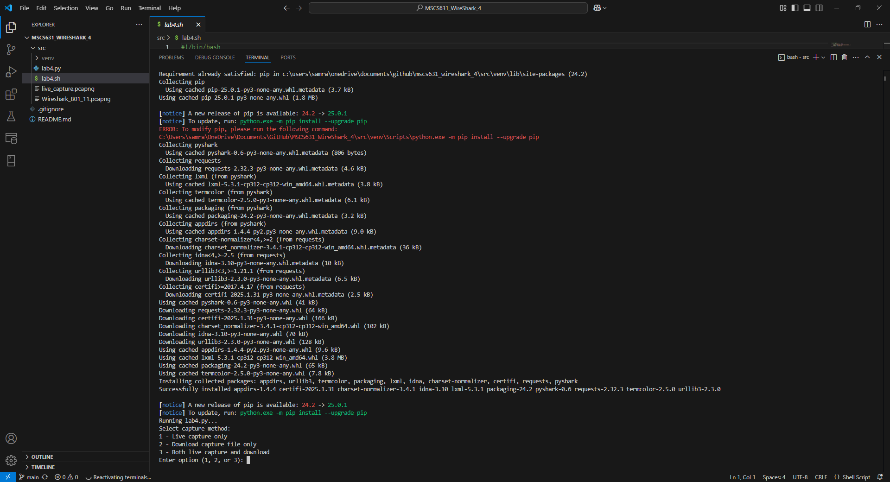
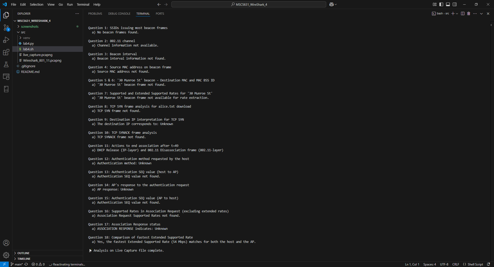
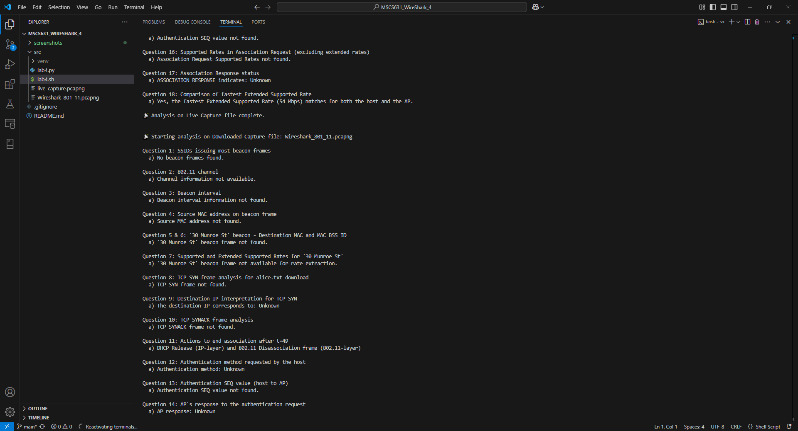

# MSCS631_WireShark_4
Wireshark – Lab 4: WIFI

**Samrat Baral**

University of the Cumberlands  

2025 Spring – Advanced Computer Networks (MSCS-631-M40) – Full Term  

Dr. Yousef Nijim

March 2, 2025

---

# Lab Overview

In this lab, you will investigate the 802.11 wireless network protocol. You’ll capture a trace from a wireless 802.11 Wi-Fi interface on your computer/laptop. See the attached document for full lab instructions. The trace includes beacon frames from multiple access points (APs), TCP data from HTTP sessions, and the association/disassociation process for the wireless host. The lab instructions (and accompanying PDF) describe the process of filtering frames in Wireshark and then answering 18 questions regarding beacon information, MAC addressing, data transfer, and association procedures.

---

## Output Screenshots

  
  
  

## Features

## Prerequisites

- **Python 3.x**
- **Tshark:** Ensure that Tshark is installed and available in your system's PATH.  
  Download from [Wireshark](https://www.wireshark.org/download.html).
- **Pyshark:** Install via pip: 
```bash
pip install pyshark
python3 lab4.py
```

This lab uses a provided trace file to automatically answer questions about 802.11 beacon frames and a TCP SYN segment. We use the trace file from the Wireshark Labs available at:

[http://gaia.cs.umass.edu/wireshark-labs/wireshark-traces-8.1.zip](http://gaia.cs.umass.edu/wireshark-labs/wireshark-traces-8.1.zip)

After downloading and extracting the zip file, ensure that **Wireshark_801_11.pcapng** is in the same directory as `lab4.py` (or update the path accordingly).

## Problem
   - Identify the two most frequent SSIDs issuing beacon frames.
   - Determine the channel used by the APs.
   - Extract the beacon interval.
   - Get the source MAC address from a beacon frame.
   - Retrieve the destination MAC address from the "30 Munroe St" beacon.
   - Retrieve the BSS ID from the "30 Munroe St" beacon.
   - Extract both Supported Rates and Extended Supported Rates from the "30 Munroe St" beacon.
   - Analyze the TCP SYN frame for the HTTP request (alice.txt) and extract MAC and IP fields.
   - Determine if the destination IP corresponds to the destination web server.
    - Analyze the TCP SYNACK frame and extract MAC addresses.
    - Identify the actions taken to end association.
    - Determine the authentication method used.
    - Extract the Authentication SEQ value from host to AP.
    - Determine if the AP accepted the authentication.
    - Extract the Authentication SEQ value from AP to host.
    - Extract the Supported Rates from the Association Request (excluding extended rates).
    - Determine if the Association Response indicates success.
    - Verify if the fastest Extended Supported Rate offered by the host matches that of the AP.

## Running the Analysis

A shell script (`lab4.sh`) is provided to create a virtual environment, install required packages (pyshark and requests), run the analysis script (`lab4.py`), and deactivate the environment.

### To Run:

1. Place **lab4.py**, **lab.md**, and **lab4.sh** in your project directory.

2. Ensure that **Wireshark_801_11.pcapng** is not present (to trigger capture or download) or update the path accordingly.

3. Open a Bash shell (Git Bash, WSL, etc.) in your project directory.

4. Make the shell script executable:.
   
```bash
chmod +x lab4.sh
```
```bash
./lab4.sh
```
   ## Output: 

```bash
./lab4.sh       
Activating virtual environment...
Upgrading pip and installing required packages...
Requirement already satisfied: pip in ./venv/lib/python3.13/site-packages (25.0.1)
 -
 - #  more items here
 - 
Running lab4.py...
📡 Starting analysis of capture file: Wireshark_801_11.pcapng

Question 1: SSIDs issuing most beacon frames
  a) No beacon frames found.

Question 2: 802.11 channel
  a) Channel information not available.
 -
 - #  more items here
 - 
📡 Analysis complete.
Deactivating virtual environment...
```


## Lab Analysis and Answers to Questions

### 1. What are the SSIDs of the two access points that are issuing most of the beacon frames in this trace? [Hint: look at the Info field. To display only beacon frames, neter wlan.fc.type_subtype == 8 into the Wireshark display filter].

---

### 2. What 802.11 channel is being used by both of these access points [Hint: you’ll need to dig into the radio information in an 802.11 beacon frame]
---

### 3. What is the interval of time between the transmissions of beacon frames from this access point (AP)? (Hint: this interval of time is contained in a field within the beacon frame itself).
---

### 4. What (in hexadecimal notation) is the source MAC address on the beacon frame from this access point? Recall from Figure 7.13 in the text that the source, destination, and BSS are three addresses used in an 802.11 frame. For a detailed discussion of the 802.11 frame structure, see section 9.2.3-9.2.4.1in the IEEE 802.11 standards document, excerpted here.
---

### 5. What (in hexadecimal notation) is the destination MAC address on the beacon frame from 30 Munroe St??
---

### 6. What (in hexadecimal notation) is the MAC BSS ID on the beacon frame from 30 Munroe St?
---

### 7. The beacon frames from the 30 Munroe St access point advertise that the access point can support four data rates and eight additional “extended supported rates.” What are these rates? [Note: the traces were taken on a rather old AP].
---

### 8. Find the 802.11 frame containing the SYN TCP segment for this first TCP session (that downloads alice.txt) at t=24.8110. What are three MAC address fields in the 802.11 frame? Which MAC address in this frame corresponds to the wireless host (give the hexadecimal representation of the MAC address for the host)? To the access point? To the first-hop router? What is the IP address of the wireless host sending this TCP segment? What is the destination IP address for the TCP syn segment?
---

### 9. Does the destination IP address of this TCP SYN correspond to the host, access point, first-hop router, or the destination web server?
---

### 10. Find the 802.11 frame containing the SYNACK segment for this TCP session received at t=24.8277 What are three MAC address fields in the 802.11 frame? Which MAC address in this frame corresponds to the host? To the access point? To the first-hop router? Does the sender MAC address in the frame correspond to the IP address of the device that sent the TCP segment encapsulated within this datagram? (Hint: review Figure 6.19 in the text if you are unsure of how to answer this question, or the corresponding part of the previous question. It’s particularly important that you understand this).
---

### 11. What two actions are taken (i.e., frames are sent) by the host in the trace just after t=49, to end the association with the 30 Munroe St AP that was initially in place when trace collection began? (Hint one is an IP-layer action, and one is an 802.11-layer action).
---

### 12. Let’s look first at AUTHENTICATION frames. At t = 63.1680, our host tries to associate with the 30 Munroe St AP. Use the Wireshark display filter wlan.fc.subtype == 11 to show AUTHENICATION frames sent from the host to and AP and vice versa. What form of authentication is the host requesting?
---

### 13. What is the Authentication SEQ value (authentication sequence number) of this authentication frame from host to AP?
---

### 14. The AP response to the authentication request is received at t = 63.1690. Has the AP accepted the form of authentication requested by the host?
---

### 15. What is the Authentication SEQ value of this authentication frame from AP to Host?
---

### 16. What rates are indicated in the frame as SUPPORTED RATES. Do not include in your answers below any rates that are indicates as EXTENDED SUPPORTE RATES.
---

### 17. Does the ASSOCIATION RESPONSE indicate a Successful or Unsuccessful association response?
---

### 18. Does the fastest (largest) Extended Supported Rate the host has offered match the fastest (largest) Extended Supported Rate the AP is able to provide?

---

## Troubleshooting


## Conclusion


